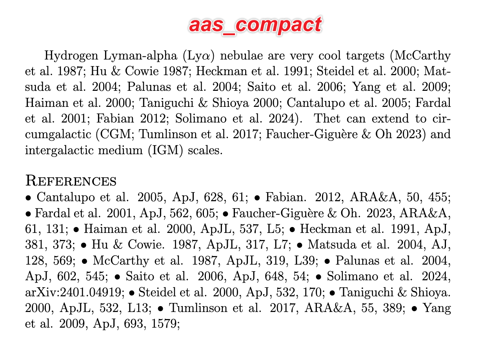
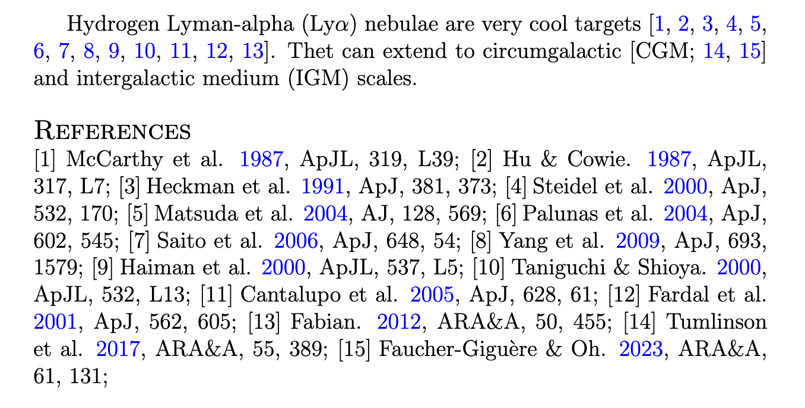

Making a REALLY compact bibliography
====================================

Tool for making an ApJ-style bibliography (e.g. using natbib so you can use \citep) in a really compact form, e.g.::

   ·Blah et al 2010 ·Foo et al 1920 ·Bar et al 1888

    or

   [1]Blah et al 2010 [2]Foo et al 1920 [3]Bar et al 1888

instead of::

   Blah et al 2010 
   Foo et al 1920 
   Bar et al 1888

Instructions
------------

Two styles are provided: author-year style (`aas_compact`) and numeric style (`aas_compact-numeric`).

Save file `aas_compact.bst` and `aas_compact.tex` (or `aas_compact-numeric.bst` and `aas_compact-numeric.tex`) in the same path as your main `.tex` file.

Include `aas_compact.tex` in your header, e.g.::

    \input{aas_compact}

    or

    \input{aas_compact-numeric}

Then import your `.bib` file at the place where you want to show the references::

   \bibliography{the_path_of_your_bib_file.bib}

REFERENCES
----------

 * https://github.com/keflavich/tex_compact_bib
 * https://tex.stackexchange.com/questions/5571/reduce-bibliography-to-one-line
 * http://www.ctex.org/documents/packages/table/paralist.pdf
 * https://tex.stackexchange.com/questions/11903/reduce-natbib-bibliography-to-one-line
 * https://tex.stackexchange.com/questions/699587/reference-with-no-new-lines-breaks-internal-links

And especially crucial for understanding the borderline-insane RPN choice in bst:

 * http://tug.ctan.org/info/bibtex/tamethebeast/ttb_en.pdf

.. _bib_macros.tex: bib_macros.tex

